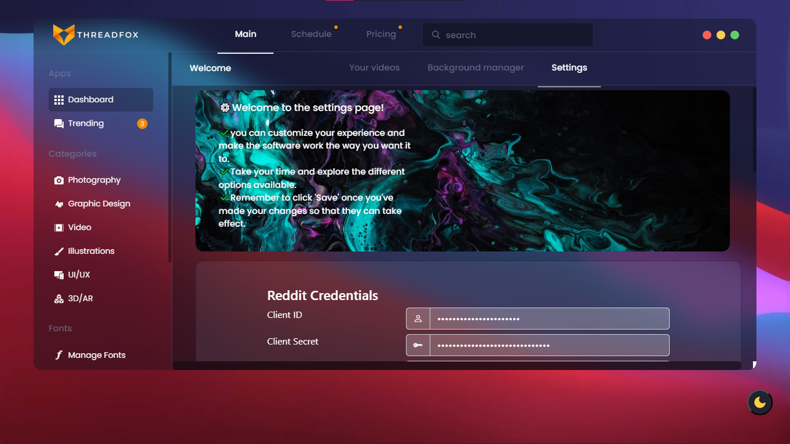

    

# Threadfox - AI Video Content Creation SaaS

## Disclaimer

**Please Note:** The code for this software is strictly classified, as it is currently in the process of being prepared for production and release. This repository is intended for demonstration purposes only. Any unauthorized use, distribution, or replication of this code is strictly prohibited.

## Preview

  
Click to expand for more images

  
  
  
   
    
     
      .png)
       .png)
        .png)
        .png)
        
        

## Live Demo

🌐 Explore the live demo of THREADFOX's landing page: [**Live Demo**](https://sami-souissi.github.io/Threadfox---AI-Video-Content-Creation-SaaS-Landing-Page-/) 

## Table of Contents

- [Introduction](#introduction)
- [Functionality](#functionality)
- [Technical Details](#technical-details)
- [Getting Started](#getting-started)
- [Usage](#usage)
- [License](#license)

## Introduction

Threadfox is a cutting-edge web-based Software-as-a-Service (SaaS) application designed to simplify and automate video content creation. Whether you're a content creator, media manager, marketing firm, or freelancer, Threadfox is your go-to solution for effortlessly transforming text from Reddit into engaging videos. This powerful platform leverages the Reddit API and state-of-the-art text-to-speech (TTS) technology to generate high-quality audio. Furthermore, Threadfox allows you to download and edit videos from YouTube, trim them to your desired length, and overlay them with the TTS audio for the creation of stunning final videos.

## Functionality

Threadfox offers an array of features that empower users to create compelling video content with minimal effort. Here are some key features:

1. **Reddit API Integration:** Seamlessly pull text from any subreddit and thread of your choice using the Reddit API.

2. **Text-to-Speech Conversion:** Employ various TTS engines, including Google Translate, pyttsx3, and TikTok TTS, to convert Reddit text into top-quality audio.

3. **Video Download and Editing:** Download videos from YouTube and effortlessly trim them to your desired length. Threadfox also provides the option to overlay TTS audio onto the video and add a watermark logo.

4. **Trending Subreddit:** Real-time determination of trending subreddits using the Reddit API.

5. **Scheduling Functionality:** Plan your video uploads in advance with Threadfox's scheduling feature.

6. **Customizable Settings:** Tailor your video creation process by customizing various settings such as the TTS engine, video length, watermark position, and more.

## Output

  <table style="text-align:center;">
    <tr>
      <td> 
          

https://github.com/Sami-Souissi/Threadfox---AI-Video-Content-Creation-SaaS/assets/114808637/7a06c1d5-4305-441c-b266-d922db584e25

</td>
      <td>
          

https://github.com/Sami-Souissi/Threadfox---AI-Video-Content-Creation-SaaS/assets/114808637/8a839714-5d9c-4132-a212-2c91f5e868ad

</td>
    </tr>
  </table>

          

## Technical Details

Threadfox is built using a range of Python libraries, making use of cutting-edge technology for its functionalities. The following technologies are employed:

- **Python Libraries:** boto3, botocore, gTTS, moviepy, playwright, praw, prawcore, pytube, requests, rich, toml, translators, pyttsx3, Pillow, tomlkit, spacy, torch, transformers, and ffmpeg-python.

- **Front-End:** HTML, CSS, and JavaScript.

- **Local Testing Server:** Flask.

- **Cloud Hosting:** The application is designed to be hosted on Heroku.

## Getting Started

To get started with Threadfox, you'll need to set up the application and configure it to your preferences. The following steps should be followed:

1. Clone the Threadfox repository from GitHub.

2. Install the required Python libraries using `pip install -r requirements.txt`.

3. Set up your API credentials for Reddit and YouTube.

4. Configure your custom settings to match your video creation requirements.

5. Launch the application locally using Flask for testing and development.

## Usage

Threadfox is designed with simplicity and user-friendliness in mind. To start creating video content, follow these general steps:

1. Choose a subreddit and thread from Reddit.

2. Select your desired TTS engine and customize audio settings.

3. Download a video from YouTube, trim it, and apply any desired edits.

4. Overlay the TTS audio onto the video and add a watermark.

5. Review and export your final video.

For more detailed information and usage instructions, refer to the documentation.

## License

Threadfox is licensed under the [MIT License](LICENSE). 
